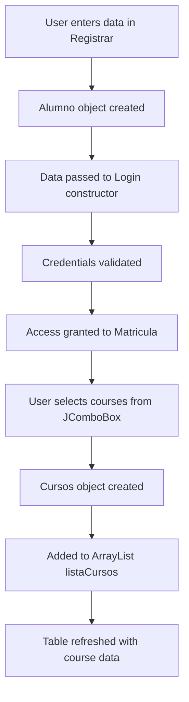
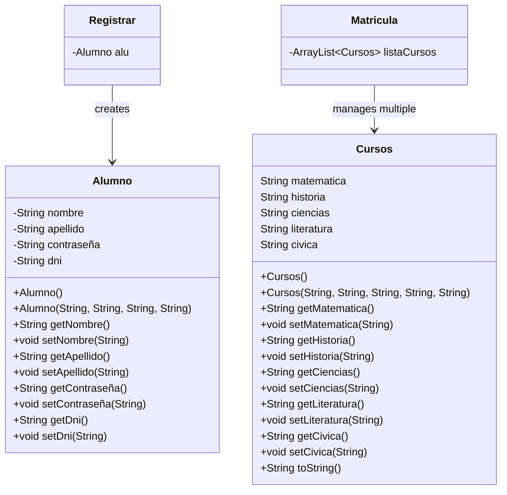

## Overview

The `logica` package contains the business logic layer with two primary data model classes: `Alumno` (Student) and `Cursos` (Courses). These POJOs (Plain Old Java Objects) follow the JavaBeans pattern with private fields and public getters/setters.

<CardGroup cols={2}>
  <Card title="Alumno" icon="user">
    Student information and credentials
  </Card>
  <Card title="Cursos" icon="book">
    Course enrollment data
  </Card>
</CardGroup>

## Alumno Class

Represents a student's personal information and authentication credentials.

### Class Definition

```java logica/Alumno.java
package logica;

public class Alumno {
    private String nombre, apellido, contraseña, dni;
    
    public Alumno() {  
    }

    public Alumno(String nombre, String apellido, String contraseña, String dni) {
        this.nombre = nombre;
        this.apellido = apellido;
        this.contraseña = contraseña;
        this.dni = dni;
    }
}
```

### Properties

<Tabs>
  <Tab title="nombre">
    **Type**: `String`
    
    **Description**: Student's first name
    
    **Getter**:
    ```java
    public String getNombre() {
        return nombre;
    }
    ```
    
    **Setter**:
    ```java
    public void setNombre(String nombre) {
        this.nombre = nombre;
    }
    ```
  </Tab>
  <Tab title="apellido">
    **Type**: `String`
    
    **Description**: Student's last name
    
    **Getter**:
    ```java
    public String getApellido() {
        return apellido;
    }
    ```
    
    **Setter**:
    ```java
    public void setApellido(String apellido) {
        this.apellido = apellido;
    }
    ```
  </Tab>
  <Tab title="dni">
    **Type**: `String`
    
    **Description**: National identification number (Documento Nacional de Identidad)
    
    **Getter**:
    ```java
    public String getDni() {
        return dni;
    }
    ```
    
    **Setter**:
    ```java
    public void setDni(String dni) {
        this.dni = dni;
    }
    ```
    
    <Info>
      The DNI serves as the username for authentication in the Login frame.
    </Info>
  </Tab>
  <Tab title="contraseña">
    **Type**: `String`
    
    **Description**: Account password
    
    **Getter**:
    ```java
    public String getContraseña() {
        return contraseña;
    }
    ```
    
    **Setter**:
    ```java
    public void setContraseña(String contraseña) {
        this.contraseña = contraseña;
    }
    ```
    
    <Warning>
      Passwords are stored as plain text strings. In a production application, passwords should be hashed using bcrypt, PBKDF2, or similar.
    </Warning>
  </Tab>
</Tabs>

### Constructors

<Steps>
  <Step title="Default Constructor">
    Creates an empty Alumno instance:
    
    ```java
    public Alumno() {}
    ```
    
    Used in the Registrar frame:
    ```java igu/Registrar.java:10
    Alumno alu = new Alumno();
    ```
  </Step>
  <Step title="Parameterized Constructor">
    Initializes all fields:
    
    ```java
    public Alumno(String nombre, String apellido, String contraseña, String dni) {
        this.nombre = nombre;
        this.apellido = apellido;
        this.contraseña = contraseña;
        this.dni = dni;
    }
    ```
  </Step>
</Steps>

### Usage Example

From the Registrar frame, student data is collected via text field listeners:

```java igu/Registrar.java:180
private void txtNombreActionPerformed(java.awt.event.ActionEvent evt) {
    String nombre = txtNombre.getText();
    alu.setNombre(nombre);
}

private void txtApellidoActionPerformed(java.awt.event.ActionEvent evt) {
    String apellido = txtApellido.getText();
    alu.setApellido(apellido);
}

private void txtDniActionPerformed(java.awt.event.ActionEvent evt) {
    String dni = txtDni.getText();
    alu.setDni(dni);
}

private void txtContraActionPerformed(java.awt.event.ActionEvent evt) {
    String contra = txtContra.getText();
    alu.setContraseña(contra);
}
```

<Accordion title="Why Use ActionPerformed for Text Fields?">
  The action listeners trigger when the user presses Enter in each field, providing real-time data binding to the Alumno object. However, the main registration logic reads directly from the text fields to ensure all data is captured even if Enter wasn't pressed.
</Accordion>

## Cursos Class

Represents a student's course selections across five subject areas.

### Class Definition

```java logica/Cursos.java
package logica;

public class Cursos {
    String matematica, historia, ciencias, literatura, civica;
    
    public Cursos() {
    }
    
    public Cursos(String matematica, String historia, String ciencias, 
                  String literatura, String civica) {
        this.matematica = matematica;
        this.historia = historia;
        this.ciencias = ciencias;
        this.literatura = literatura;
        this.civica = civica;
    }
}
```

<Note>
  Fields are declared with package-private access (no modifier), though getters and setters are public.
</Note>

### Course Properties

Each property stores the full course selection string including professor, room, and schedule:

<Tabs>
  <Tab title="matematica">
    **Type**: `String`
    
    **Example Value**: `"Matematica| Prof. Raúl Hernandez | A0504 | Lun y Mie 2:00pm a 4:00pm"`
    
    ```java
    public String getMatematica() {
        return matematica;
    }

    public void setMatematica(String matematica) {
        this.matematica = matematica;
    }
    ```
  </Tab>
  <Tab title="historia">
    **Type**: `String`
    
    **Example Value**: `"Historia| Prof. Marisol Mercede | A0304 | Lun 10:00am a 1:00pm"`
    
    ```java
    public String getHistoria() {
        return historia;
    }

    public void setHistoria(String historia) {
        this.historia = historia;
    }
    ```
  </Tab>
  <Tab title="ciencias">
    **Type**: `String`
    
    **Example Value**: `"Ciencias| Prof. Victoria Dueñas | D0405 | Mier 1:00pm a 3:00pm"`
    
    ```java
    public String getCiencias() {
        return ciencias;
    }

    public void setCiencias(String ciencias) {
        this.ciencias = ciencias;
    }
    ```
  </Tab>
  <Tab title="literatura">
    **Type**: `String`
    
    **Example Value**: `"Literat| Prof. Mario de Valle | A0107 | Mar y Sab 8:00am a 9:30am"`
    
    ```java
    public String getLiteratura() {
        return literatura;
    }

    public void setLiteratura(String literatura) {
        this.literatura = literatura;
    }
    ```
  </Tab>
  <Tab title="civica">
    **Type**: `String`
    
    **Example Value**: `"Civica| Prof. Carmela Calderon | B0102 | Lun 8:00pm a 9:00pm"`
    
    ```java
    public String getCivica() {
        return civica;
    }

    public void setCivica(String civica) {
        this.civica = civica;
    }
    ```
  </Tab>
</Tabs>

### String Representation

The class overrides `toString()` for debugging and logging:

```java logica/Cursos.java:58
@Override
public String toString() {
    return "Cursos{" + 
        "matematica=" + matematica + 
        ", historia=" + historia + 
        ", ciencias=" + ciencias + 
        ", literatura=" + literatura + 
        ", civica=" + civica + 
        '}';
}
```

**Example Output**:
```
Cursos{matematica=Matematica| Prof. Raúl Hernandez | A0504 | Lun y Mie 2:00pm a 4:00pm, historia=Historia| Prof. Marisol Mercede | A0304 | Lun 10:00am a 1:00pm, ciencias=Ninguno, literatura=Ninguno, civica=Ninguno}
```

### Usage in Matricula Frame

Course objects are created and managed in an ArrayList:

```java igu/Matricula.java:12
ArrayList<Cursos> listaCursos = new ArrayList<>();
```

When the student clicks "Agregar cursos":

```java igu/Matricula.java:413
private void btnMatematicasActionPerformed(java.awt.event.ActionEvent evt) {
    Cursos curso = new Cursos();
    curso.setMatematica(scrMatematica.getSelectedItem().toString());
    curso.setHistoria(scrHistoria.getSelectedItem().toString());
    curso.setLiteratura(scrLiteratura.getSelectedItem().toString());
    curso.setCivica(scrCivica.getSelectedItem().toString());
    curso.setCiencias(scrCiencias.getSelectedItem().toString());
    listaCursos.add(curso);
    refrescarTabla();
}
```

<Info>
  Each `Cursos` object stores a complete set of five course selections, even if some are set to "Ninguno" (None).
</Info>

## Data Flow Diagram



## Design Patterns

### JavaBeans Pattern

Both classes follow the JavaBeans specification:

<Steps>
  <Step title="Private Fields">
    All data is encapsulated with private (or package-private) access modifiers
  </Step>
  <Step title="No-Argument Constructor">
    Both classes provide a default constructor for instantiation
  </Step>
  <Step title="Getter/Setter Methods">
    Public methods provide controlled access to properties
  </Step>
  <Step title="Serializable (Optional)">
    While not implemented here, JavaBeans typically implement `Serializable` for persistence
  </Step>
</Steps>

### Data Transfer Objects (DTOs)

These classes act as DTOs, transferring data between the presentation layer (GUI frames) and the business logic layer:

| Class | Source | Destination | Purpose |
|-------|--------|-------------|----------|
| `Alumno` | Registrar form | Login frame | Authentication |
| `Cursos` | Matricula dropdowns | JTable display | Course enrollment |

## Data Storage

Currently, the application uses in-memory storage:

<Warning>
  **No Persistence**: Student and course data is lost when the application closes. All data exists only in Java objects during runtime.
</Warning>

### Current Storage Mechanism

<Tabs>
  <Tab title="Student Data">
    - Created in `Registrar` frame
    - Passed to `Login` via constructor parameters
    - Not persisted beyond the session
    
    ```java igu/Registrar.java:222
    log = new Login(dni, contra);
    ```
  </Tab>
  <Tab title="Course Data">
    - Stored in `ArrayList<Cursos>` in Matricula frame
    - Exists only in memory
    - Cleared when frame is closed
    
    ```java igu/Matricula.java:12
    ArrayList<Cursos> listaCursos = new ArrayList<>();
    ```
  </Tab>
</Tabs>

### Potential Enhancements

<Accordion title="Database Integration">
  For production use, consider adding:
  
  - **JDBC**: Connect to MySQL, PostgreSQL, or SQLite
  - **JPA/Hibernate**: Object-relational mapping
  - **Serialization**: Save objects to files
  
  Example table structure:
  
  ```sql
  CREATE TABLE alumnos (
      id INT PRIMARY KEY AUTO_INCREMENT,
      nombre VARCHAR(100),
      apellido VARCHAR(100),
      dni VARCHAR(20) UNIQUE,
      contraseña_hash VARCHAR(255)
  );
  
  CREATE TABLE cursos_matriculados (
      id INT PRIMARY KEY AUTO_INCREMENT,
      alumno_id INT,
      matematica TEXT,
      historia TEXT,
      ciencias TEXT,
      literatura TEXT,
      civica TEXT,
      fecha_matricula TIMESTAMP DEFAULT CURRENT_TIMESTAMP,
      FOREIGN KEY (alumno_id) REFERENCES alumnos(id)
  );
  ```
</Accordion>

## Field Validation

Neither data model class includes built-in validation. Validation is performed in the GUI layer:

### Alumno Validation (in Registrar)

```java igu/Registrar.java:212
if (nombre.isEmpty()) {
    JOptionPane.showMessageDialog(this, "COMPLETE SU NOMBRE", 
        "Advertencia", JOptionPane.WARNING_MESSAGE);
} else if (apellido.isEmpty()) {
    JOptionPane.showMessageDialog(this, "COMPLETE SU APELLIDO", 
        "Advertencia", JOptionPane.WARNING_MESSAGE);
} else if (dni.isEmpty()) {
    JOptionPane.showMessageDialog(this, "COMPLETE SU DNI", 
        "Advertencia", JOptionPane.WARNING_MESSAGE);
} else if (contra.isEmpty()) {
    JOptionPane.showMessageDialog(this, "COMPLETE SU CONTRASEÑA", 
        "Advertencia", JOptionPane.WARNING_MESSAGE);
}
```

<Info>
  **Improvement Opportunity**: Move validation logic into the model classes for better separation of concerns and reusability.
</Info>

## Class Diagram



## Best Practices

<CardGroup cols={2}>
  <Card title="Encapsulation" icon="lock">
    Private fields with public accessors protect data integrity
  </Card>
  <Card title="Constructor Overloading" icon="code">
    Multiple constructors provide flexibility in object creation
  </Card>
  <Card title="toString Override" icon="terminal">
    Custom string representation aids debugging
  </Card>
  <Card title="Immutability Consideration" icon="shield">
    Consider making fields final and removing setters for immutable objects
  </Card>
</CardGroup>

## Next Steps

<Card title="Architecture Overview" icon="sitemap" href="/architecture/overview">
  Return to the main architecture overview to see how these models fit into the complete system
</Card>