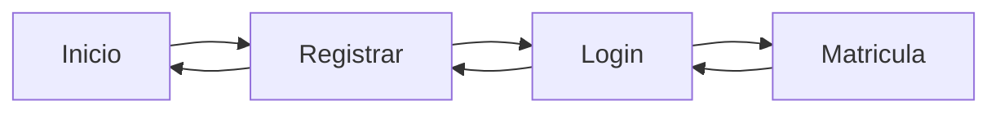

## Overview

The `igu` package contains four main JFrame classes that comprise the application's graphical user interface. Each frame is designed using NetBeans GUI Builder with a consistent visual style.

<CardGroup cols={2}>
  <Card title="Inicio" icon="home">
    Welcome screen with registration button
  </Card>
  <Card title="Registrar" icon="user-plus">
    Student registration form
  </Card>
  <Card title="Login" icon="right-to-bracket">
    Authentication interface
  </Card>
  <Card title="Matricula" icon="graduation-cap">
    Course enrollment system
  </Card>
</CardGroup>

## Inicio Frame

The welcome screen that serves as the application's entry point.

### Class Structure

```java igu/Inicio.java
package igu;

public class Inicio extends javax.swing.JFrame {
    private Registrar registrate;

    @SuppressWarnings("LeakingThisInConstructor")
    public Inicio() {
        initComponents();
        this.registrate = new Registrar();
        registrate.setIni(this);
    }
}
```

### UI Components

| Component | Type | Purpose |
|-----------|------|--------|
| `jPanel1` | JPanel | Main container with AbsoluteLayout |
| `jLabel1` | JLabel | "BIENVENIDO A LA UNIVERSIDAD" header |
| `btnRegistrarse` | JButton | Navigation to registration screen |
| `jSeparator1` | JSeparator | Visual separator line |
| `FondoPantalla` | JLabel | Background image label |

<Info>
  The frame dimensions are set to 692x370 pixels with a background image overlay.
</Info>

### Button Action Handler

```java igu/Inicio.java:74
private void btnRegistrarseActionPerformed(java.awt.event.ActionEvent evt) {
    registrate.setIni(this);
    registrate.setVisible(true);
    registrate.setLocationRelativeTo(null);
    this.setVisible(false);
}
```

<Accordion title="Navigation Flow">
  When clicked, the registration button:
  1. Sets the back-reference to this Inicio frame
  2. Makes the Registrar frame visible
  3. Centers the Registrar frame on screen
  4. Hides the current Inicio frame
</Accordion>

## Registrar Frame

The student registration form that collects personal information.

### Class Structure

```java igu/Registrar.java
package igu;

import javax.swing.JOptionPane;
import logica.Alumno;

public class Registrar extends javax.swing.JFrame {
    private Inicio ini;
    private Login log;
    Alumno alu = new Alumno();

    public Registrar() {
        initComponents();
        this.log = new Login();
        log.setRegis(this);
    }
}
```

### Input Fields

<Steps>
  <Step title="Nombre">
    `txtNombre` - Student's first name (JTextField)
  </Step>
  <Step title="Apellido">
    `txtApellido` - Student's last name (JTextField)
  </Step>
  <Step title="DNI">
    `txtDni` - National identification number (JTextField)
  </Step>
  <Step title="Contraseña">
    `txtContra` - Account password (JTextField)
  </Step>
</Steps>

### Action Buttons

<Tabs>
  <Tab title="Registrarse">
    Validates all fields and creates the student account:
    
    ```java igu/Registrar.java:207
    private void btnRegistrarseActionPerformed(java.awt.event.ActionEvent evt) {
        String nombre = txtNombre.getText();
        String apellido = txtApellido.getText();
        String dni = txtDni.getText();
        String contra = txtContra.getText();
        
        if (nombre.isEmpty()) {
            JOptionPane.showMessageDialog(this, "COMPLETE SU NOMBRE", 
                "Advertencia", JOptionPane.WARNING_MESSAGE);
        } else if (apellido.isEmpty()) {
            JOptionPane.showMessageDialog(this, "COMPLETE SU APELLIDO", 
                "Advertencia", JOptionPane.WARNING_MESSAGE);
        } else if (dni.isEmpty()) {
            JOptionPane.showMessageDialog(this, "COMPLETE SU DNI", 
                "Advertencia", JOptionPane.WARNING_MESSAGE);
        } else if (contra.isEmpty()) {
            JOptionPane.showMessageDialog(this, "COMPLETE SU CONTRASEÑA", 
                "Advertencia", JOptionPane.WARNING_MESSAGE);
        } else {
            JOptionPane.showMessageDialog(null, "REGISTRO EXITOSO");
            log = new Login(dni, contra);
            log.setRegis(this);
            log.setVisible(true);
            log.setLocationRelativeTo(null);
            this.setVisible(false);
        }
    }
    ```
  </Tab>
  <Tab title="Eliminar">
    Clears all input fields:
    
    ```java igu/Registrar.java:230
    private void btnEliminarActionPerformed(java.awt.event.ActionEvent evt) {
        txtNombre.setText("");
        txtApellido.setText("");
        txtDni.setText("");
        txtContra.setText("");
    }
    ```
  </Tab>
  <Tab title="Volver">
    Returns to the welcome screen:
    
    ```java igu/Registrar.java:200
    private void btnVolverActionPerformed(java.awt.event.ActionEvent evt) {
        ini.setRegistrate(this);
        ini.setVisible(true);
        ini.setLocationRelativeTo(null);
        this.setVisible(false);
    }
    ```
  </Tab>
</Tabs>

<Warning>
  The application performs field validation sequentially. All fields must be filled before registration succeeds.
</Warning>

### Data Binding

Each text field has an action listener that updates the `Alumno` object:

```java igu/Registrar.java:180
private void txtNombreActionPerformed(java.awt.event.ActionEvent evt) {
    String nombre = txtNombre.getText();
    alu.setNombre(nombre);
}

private void txtApellidoActionPerformed(java.awt.event.ActionEvent evt) {
    String apellido = txtApellido.getText();
    alu.setApellido(apellido);
}

private void txtDniActionPerformed(java.awt.event.ActionEvent evt) {
    String dni = txtDni.getText();
    alu.setDni(dni);
}

private void txtContraActionPerformed(java.awt.event.ActionEvent evt) {
    String contra = txtContra.getText();
    alu.setContraseña(contra);
}
```

## Login Frame

Authentication screen that validates student credentials.

### Class Structure

```java igu/Login.java
package igu;

import javax.swing.JOptionPane;

public class Login extends javax.swing.JFrame {
    private Registrar regis;
    private Matricula matri;
    private String regisDni;
    private String regisContra;

    public Login() {
        this("", "");
        initComponents();
    }
    
    public Login(String regisDni, String regisContra) {
        this.regisDni = regisDni;
        this.regisContra = regisContra;
        this.matri = new Matricula();
        matri.setLog(this);
        initComponents();
    }
}
```

<Note>
  The Login frame uses constructor overloading to accept credentials from the Registrar frame.
</Note>

### Authentication Components

| Component | Type | Description |
|-----------|------|------------|
| `txtUsuario` | JTextField | DNI input field |
| `pswContra` | JPasswordField | Password input (masked) |
| `btnIniciarSesion` | JButton | Submit credentials |
| `btnVolver` | JButton | Return to registration |
| `jPanel1` | JPanel | Main form panel (dark teal) |
| `jPanel2` | JPanel | Side panel with logo (white) |

### Authentication Logic

```java igu/Login.java:171
private void btnIniciarSesionActionPerformed(java.awt.event.ActionEvent evt) {
    String usuario = txtUsuario.getText();
    String contra = new String(pswContra.getPassword());
    
    if (usuario.equals(regisDni) && contra.equals(regisContra)) {
        JOptionPane.showMessageDialog(null, "INICIO EXITOSO");
        matri.setLog(this);
        matri.setVisible(true);
        matri.setLocationRelativeTo(null);
        this.setVisible(false);
    } else {
        JOptionPane.showMessageDialog(this, 
            "USUARIO O CONTRASEÑA INCORRECTA", 
            "Error", 
            JOptionPane.ERROR_MESSAGE);
    }
}
```

<Warning>
  Credentials are stored in plain text and validated using simple string comparison. This is suitable for educational purposes but not production use.
</Warning>

### Layout Design

The Login frame uses a split-panel design:

- **Left Panel (240x345)**: White background with university logo image
- **Right Panel (350x345)**: Dark teal background with login form

## Matricula Frame

The course enrollment interface featuring dropdown selection and table display.

### Class Structure

```java igu/Matricula.java
package igu;

import java.util.ArrayList;
import javax.swing.JOptionPane;
import javax.swing.table.DefaultTableModel;
import logica.Cursos;

public final class Matricula extends javax.swing.JFrame {
    private Login log;
    
    ArrayList<Cursos> listaCursos = new ArrayList<>();
    DefaultTableModel modelo = new DefaultTableModel();
  
    public Matricula() {
        initComponents();
        modelo = new DefaultTableModel();
        modelo.addColumn("Cursos");
        refrescarTabla();
    }
}
```

### Course Selection

The frame provides five `JComboBox` components for course selection:

<Tabs>
  <Tab title="Matemática">
    ```java
    scrMatematica.setModel(new javax.swing.DefaultComboBoxModel<>(new String[] { 
        "Ninguno", 
        "Matematica| Prof. Raúl Hernandez  | A0504  | Lun y Mie  2:00pm a 4:00pm", 
        "Matematica| Prof. Javier Paucar   | A0307  | Mar y Jue  2:00pm a 4:00pm", 
        "Matematica| Prof. Amanda Ruiz     | B0603  | Lun y Mie  4:30pm a 6:30pm", 
        "Matematica| Prof. Jose Romero     | C0504  | Mar y Jue  4:30pm a 6:30pm" 
    }));
    ```
  </Tab>
  <Tab title="Historia">
    ```java
    scrHistoria.setModel(new javax.swing.DefaultComboBoxModel<>(new String[] { 
        "Ninguno", 
        "Historia| Prof. Marisol Mercede | A0304  | Lun  10:00am a 1:00pm", 
        "Historia| Prof. Carlos Alberto  | A0105  | Jue   9:00am a 11:00pm", 
        "Historia| Prof. Luis Campos     | B0503  | Mie   1:00pm a 4:00pm", 
        "Historia| Prof. Juan Lopez      | C0704  | Mar  5:00pm a 8:00pm" 
    }));
    ```
  </Tab>
  <Tab title="Literatura">
    ```java
    scrLiteratura.setModel(new javax.swing.DefaultComboBoxModel<>(new String[] { 
        "Ninguno", 
        "Literat| Prof. Mario de Valle  | A0107  | Mar y Sab  8:00am a 9:30am", 
        "Literat| Prof. Sara Ordoñez    | C0405  | Lun y Vier  9:00am a 10:30am", 
        "Literat| Prof. Mario Lopez     | A403   | Lun y Mar  10:30am a 11:30am", 
        "Literat| Prof. Renato Arevalo  | C0202  | Mar y Mier  11:00am a 1:30pm" 
    }));
    ```
  </Tab>
  <Tab title="Cívica">
    ```java
    scrCivica.setModel(new javax.swing.DefaultComboBoxModel<>(new String[] { 
        "Ninguno", 
        "Civica| Prof. Carmela Calderon | B0102  | Lun 8:00pm a 9:00pm", 
        "Civica| Prof. Percy Coronel    | A0804  | Mar 5:00pm a 6:00pm", 
        "Civica| Prof. Antonio Lima     | B0709  | Sab 9:00am a 10:00am", 
        "Civica| Prof. Solano Ventura   | C0502  | Vier 10:00am a 11:00am" 
    }));
    ```
  </Tab>
  <Tab title="Ciencias">
    ```java
    scrCiencias.setModel(new javax.swing.DefaultComboBoxModel<>(new String[] { 
        "Ninguno", 
        "Ciencias| Prof. Victoria Dueñas | D0405 | Mier 1:00pm a 3:00pm", 
        "Ciencias| Prof. Oscar Orihuela  | B0305 | Jue 8:00am a 10:00am", 
        "Ciencias| Prof. Hernan Rios     | B0107 | Jue 11:30am a 1:30pm", 
        "Ciencias| Prof. Lidia Toscano   | A0804 | Jue 6:00pm a 8:00pm" 
    }));
    ```
  </Tab>
</Tabs>

### Course Management Actions

<Steps>
  <Step title="Add Courses">
    The `btnMatematicas` button adds selected courses to the enrollment table:
    
    ```java igu/Matricula.java:413
    private void btnMatematicasActionPerformed(java.awt.event.ActionEvent evt) {
        Cursos curso = new Cursos();
        curso.setMatematica(scrMatematica.getSelectedItem().toString());
        curso.setHistoria(scrHistoria.getSelectedItem().toString());
        curso.setLiteratura(scrLiteratura.getSelectedItem().toString());
        curso.setCivica(scrCivica.getSelectedItem().toString());
        curso.setCiencias(scrCiencias.getSelectedItem().toString());
        listaCursos.add(curso);
        refrescarTabla();
    }
    ```
  </Step>
  <Step title="Delete Row">
    Remove a single selected row from the table:
    
    ```java igu/Matricula.java:424
    private void btnEliminar_filaActionPerformed(java.awt.event.ActionEvent evt) {
        int fila = tblMatricula.getSelectedRow();
        if (fila >= 0) {
            modelo.removeRow(fila);
        } else {
            JOptionPane.showMessageDialog(null, "Seleccionar Fila");
        }
    }
    ```
  </Step>
  <Step title="Delete All">
    Clear all rows from the enrollment table:
    
    ```java igu/Matricula.java:433
    private void btnEliminar_todoActionPerformed(java.awt.event.ActionEvent evt) {
        int fila = tblMatricula.getRowCount();
        for (int i = fila - 1; i >= 0; i--) {
            modelo.removeRow(i);
        }
    }
    ```
  </Step>
  <Step title="Complete Enrollment">
    Finalize the course enrollment:
    
    ```java igu/Matricula.java:447
    private void btnRegistrarActionPerformed(java.awt.event.ActionEvent evt) {
        JOptionPane.showMessageDialog(null, "MATRICULA COMPLETADA");
    }
    ```
  </Step>
</Steps>

### Table Refresh Logic

The `refrescarTabla()` method populates the JTable with enrolled courses:

```java igu/Matricula.java:368
public void refrescarTabla() {
    for (Cursos curso : listaCursos) {
        Object a[] = new Object[1];
        
        a[0] = curso.getMatematica();
        modelo.addRow(a);
        
        a[0] = curso.getHistoria();
        modelo.addRow(a);
        
        a[0] = curso.getLiteratura();
        modelo.addRow(a);
        
        a[0] = curso.getCivica();
        modelo.addRow(a);
        
        a[0] = curso.getCiencias();
        modelo.addRow(a);
    }
    
    tblMatricula.setModel(modelo);
}
```

<Info>
  The table displays all five course selections from each `Cursos` object as separate rows.
</Info>

## Common Design Patterns

All GUI frames share these design characteristics:

### Color Consistency

```java
// Dark Teal Background
jPanel1.setBackground(new java.awt.Color(0, 68, 68));

// Button Color
btnRegistrarse.setBackground(new java.awt.Color(0, 153, 153));

// White Text
jLabel1.setForeground(new java.awt.Color(255, 255, 255));

// White Separators
jSeparator1.setForeground(new java.awt.Color(255, 255, 255));
```

### Font Styles

| Element | Font | Size | Style |
|---------|------|------|-------|
| Headers | Segoe UI / Serif | 18-36pt | Bold |
| Labels | Segoe UI | 14pt | Bold |
| Buttons | Segoe UI | 12-14pt | Bold |
| Hints | Segoe UI | 8pt | Italic |

### Layout Management

<Accordion title="AbsoluteLayout Usage">
  Most frames use NetBeans' AbsoluteLayout for precise component positioning:
  
  ```java
  jPanel1.add(btnRegistrarse, 
      new org.netbeans.lib.awtextra.AbsoluteConstraints(281, 294, 130, 40));
  ```
  
  Parameters: (x, y, width, height)
</Accordion>

## Navigation Graph



## Next Steps

<Card title="Data Models" icon="database" href="/architecture/data-model">
  Learn about the Alumno and Cursos classes that power the GUI components
</Card>